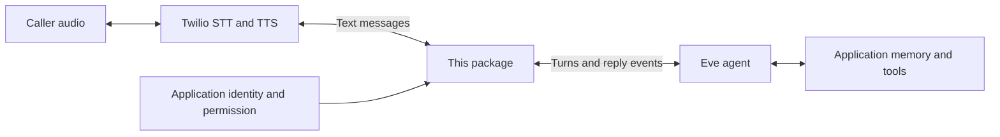

# PIPEY · Eve ConversationRelay

A library that adds Twilio ConversationRelay phone conversations to Eve agents.

[](https://github.com/Jorybraun/eve-conversation-relay/actions/workflows/ci.yml)
[MIT licensed](LICENSE)

Release candidate, version 0.1.0. **Not published on npm yet.** Prepared under
the proposed `@pipey` scope with an MIT license. **Use Eve 0.70.1 for new projects.**
The package is locally tested with Eve 0.70.1 and legacy 0.63.0; other versions
are not declared compatible. Node 24+, ESM.

Legacy 0.63.0 remains supported for existing consumers such as PIPEY. Its npm
dependency tree included advisories affecting its pinned Undici 8.9.0 during the October 2,
2026 audit. The 0.70.1 starter resolves Eve's Undici dependency to 8.10.2 and had
no reported npm advisories in that audit. Compatibility tests do not replace
dependency review or live-call verification.

## Give your Eve agent a phone number

Use [the complete incoming-call starter](examples/inbound/README.md). It includes
an Eve agent, a phone channel, a persistent SQLite call store, an environment
template and exact dependencies. It runs independently of PIPEY on one Node host.

1. Unpack the starter from the release tarball and install it, following its README.
2. Supply your Twilio settings, model credential and public HTTPS origin.
3. Start Eve with `npm run dev`, exposing its port through an HTTPS/WSS tunnel.
4. Point your Twilio number's incoming-call webhook at `POST /phone/answer`.
5. Call the number from an allowed caller ID for a supervised test.

The library validates Twilio's signed request, answers with speech configuration,
opens a WebSocket conversation and sends the caller's words to your Eve agent.
The agent keeps its own instructions, model, tools and memory.

Download the package tarball from [GitHub Releases](https://github.com/Jorybraun/eve-conversation-relay/releases).
For an existing project, install that tarball:

```sh
npm install eve@0.70.1 /absolute/path/pipey-eve-conversation-relay-0.1.0.tgz
```

After the first npm publication, the equivalent command will be:

```sh
npm install eve@0.70.1 @pipey/eve-conversation-relay
```

The ready-made channel is exported from `@pipey/eve-conversation-relay/channel`.
Export its `conversationRelayChannel(...)` result from `agent/channels/phone.ts`;
Eve discovers it using its normal custom-channel convention. The starter contains
[the complete configuration](examples/inbound/agent/channels/phone.ts).
No Eve fork, plugin registry, extension compiler or core modification is required.

`conversationRelayChannel` creates `POST /phone/answer` and
`WS /phone/stream/:callSid` (prefix configurable). It verifies the external URLs,
Twilio account, called number and stored call before accepting speech. The host
provides `authorize` and an `InboundCallStore` with atomic `putIfAbsent`, `get`
and `claimOnce` operations. Caller ID alone is not verified application identity;
the starter grants an anonymous helpdesk session with no private account access.

This channel supports **incoming calls**. Existing outgoing-call applications,
including PIPEY, use the lower-level API below. Dialing, number provisioning,
status callbacks and SMS are outside this package.

## What is reusable?

The adapter knows how to translate Twilio's text messages into Eve turns and Eve's
reply events into Twilio speech requests. It has no candidate, CRM, database,
Next.js, Vercel, model-provider, or application-prompt dependency. `eve` is a peer
dependency; the consuming application provides its runtime. The core entry point
uses type-only Eve imports. The `/channel` entry point uses Eve's public channel
and Twilio request-verification APIs at runtime.



Three things can vary independently:

1. **The application:** PIPEY supplies candidate identity and consent; a helpdesk
   supplies customer identity and permission. Neither is built into the package.
2. **The Eve agent:** the host chooses its model, tools, instructions and memory.
3. **Managed speech providers:** the host configures Twilio's STT and TTS choices.

This is a Twilio ConversationRelay adapter, not a general audio-processing SDK.
It never receives raw audio. Direct OpenAI speech APIs, a custom STT engine,
browser audio, or a speech-to-speech model require another transport adapter.
Twilio also has a `play` URL message for externally generated audio; this package
does not implement that mode.

## Configure speech

```ts
import { buildConversationRelayTwiml } from "@pipey/eve-conversation-relay";

const xml = buildConversationRelayTwiml({
  streamUrl: "wss://your-app.example/voice/call-123",
  stt: { provider: "Deepgram", model: "nova-3-general" },
  tts: { provider: "ElevenLabs", voice: "YOUR_VOICE_ID" },
  language: "en-US",
  greeting: "Hello, I'm your AI assistant.",
  endMessage: "The call has ended.",
});
```

To select different providers, change only the speech configuration:

```ts
stt: { provider: "Google", model: "telephony" },
tts: { provider: "Amazon", voice: "Joanna-Neural" },
```

| Component | Documented provider choices |
| --- | --- |
| STT | `Deepgram`, `Google` |
| TTS | `ElevenLabs`, `Google`, `Amazon` |

The builder checks provider names, a credential-free `wss:` URL, nonempty model
and voice IDs, and the documented `multi` language restrictions. Values are XML
escaped. Model/voice/language availability and account enablement remain Twilio's
responsibility. Generating valid XML does not prove a provider combination works
in your account. Flux configuration disables partial prompts; the relay dispatches
finalized utterances only. Optional `stt.language` and `tts.language` override the
shared language.

Sources checked October 2, 2026: [TwiML](https://www.twilio.com/docs/voice/twiml/connect/conversationrelay),
[voices](https://www.twilio.com/docs/voice/conversationrelay/voice-configuration),
[WebSocket protocol](https://www.twilio.com/docs/voice/conversationrelay/websocket-messages).

## Integrate with an existing call workflow

Inside your authenticated Eve `WS` route:

```ts
return createConversationRelay({
  call: verifiedCall, // accountSid, callSid, from, to, from your trusted call store
  session: {
    auth: verifiedUser,
    context: ["Help the caller with their support question."],
    start: (message, options) => from(verifiedCall.callSid).send(message, options),
  },
  authorize: () => mayContinue(verifiedCall.callSid),
  claim: () => claimConnectionOnce(verifiedCall.callSid),
  onInterruption: event => recordInterruption(verifiedCall.callSid, event),
  waitUntil: task => registerWithHost(task),
});
```

The names `verifiedCall`, `verifiedUser`, `mayContinue`, `claimConnectionOnce`,
`recordInterruption`, and `registerWithHost` are application functions/values.
See [the complete typed helpdesk consumer](examples/helpdesk.ts).

The core entry point exposes two functions: `buildConversationRelayTwiml` builds the answer XML;
`createConversationRelay` returns the Eve WebSocket lifecycle hooks. The host
owns route authentication, call creation, status callbacks and HTTP responses.

### Walk through one turn

1. The app verifies `X-Twilio-Signature` against the public **WSS** URL before
   constructing the relay. The package checks Twilio's subsequent `setup` against
   `call`, calls `authorize`, and atomically claims the connection through `claim`.
2. Twilio transcribes speech and sends a final `prompt`. The relay rechecks
   authorization, then calls `session.start` for the first utterance.
3. `session.start` forwards the package's `auth`, `context` and `turnPolicy: "queue"`
   to Eve. Later utterances use the returned fixed Eve session handle.
4. Eve runs the host's normal model/tools/memory. The relay streams assistant text
   back to Twilio. Tool output and reasoning are not spoken.
5. If the caller interrupts, outgoing stale text is suppressed immediately.
   `onInterruption` receives a provider-reported `heardText`, optional `durationMs`,
   and an event ID. Its `turnId` is null for an interrupted preset greeting. This
   is not an independent playback receipt. App storage should scope IDs by call.
6. Hanging up closes transport reading. It does not cancel the accepted Eve turn
   or its durable memory work.

### Session and state contract

Use a **fresh per-call Eve address** and an atomic, durable one-connection claim.
Attaching arbitrary existing session history is unsupported: old events cannot be
correlated to this connection's speech. A shared authenticated principal can still
share your configured memory across phone, web and other sessions.

This module owns only per-connection queues, stream readers, generation counters
and deduplication sets. The application owns identity, authorization, call claims,
transcript persistence and reconnect policy. Eve owns durable session state.

Construct the relay once while upgrade context is active: `waitUntil` registers
its lifetime synchronously, before any socket hook runs. A Vercel host may need
`@vercel/functions`' `waitUntil`; PIPEY supplies that choice outside the package.

`maxDurationMs` defaults to 270000. Setup and cleanup have separate 10-second
bounds. The host's function duration and Twilio call limit must allow for them.
Malformed frames, failed authorization, duplicate claims, rejected dispatches,
stream failures and a rejected interruption callback close transport with 1011.
Invalid static configuration throws `TypeError` before opening a relay.
Content-free `onDiagnostic` events report phases; diagnostic callback errors are
ignored. There is no automatic redial or reconnect.

The relay deduplicates observed Eve event IDs and repeated hook frame IDs. It
does not promise exactly-once telephony delivery. Identical spoken text can be
two legitimate utterances.

## Run and verify locally

For maintainers, from this package's **source checkout**:

```sh
git clone https://github.com/Jorybraun/eve-conversation-relay.git
cd eve-conversation-relay
npm ci --ignore-scripts
npm run check
npm run demo
npm run test:package
npm pack --pack-destination /tmp
```

`demo` is a labeled offline library-assistant simulation using the compiled
package. It exercises configuration, transcript dispatch, streaming, interruption
and cleanup without credentials, model inference or a phone call.

`test:package` builds and audits the npm tarball, creates a temporary project
outside the workspace, installs the artifact with npm, typechecks and tests the
included starter, runs the simulation, compiles the real Eve application, then
starts it on localhost to check signed HTTP/WebSocket routes and rejection of
direct session creation. It downloads public npm dependencies and needs permission
to bind a local port. It does not call Twilio or a model.
Pass `-- --offline` to use an already populated npm cache. The installed tarball
contains runtime files and examples, not maintainer source/test scripts.

The default consumer uses the recommended Eve 0.70.1. Run
`EVE_TEST_VERSION=0.63.0 npm run test:package` to check the legacy consumer.
Only those two exact versions are accepted. CI tests source builds, types and
unit tests with each installed Eve version, then runs the matching consumer check;
its version overrides do not change the committed lockfile.

Package tests use public interfaces and fictional data. PIPEY separately tests
the adapter with its actual installed Eve queue/correlation behavior, call
authorization and generated-memory hooks. These are **local** checks; live
STT/TTS, audio latency, deployment and carrier delivery require a supervised call.

## Release boundary

Owner: PIPEY maintainers. Public API: the two core functions and types exported
from `src/index.ts`, plus `conversationRelayChannel` and its types from `/channel`.
Version 0.1.0 is an unpublished release candidate. The tarball contains compiled
code, declarations, this README, the MIT license and fictional examples.

Before an npm release: confirm npm scope ownership,
complete independent review, and run a supervised provider test. A published
library can be offered to Eve maintainers separately; upstream adoption is not
required for consumers to install it. Preserve the current single-transport scope;
broader speech support should be justified by a second implemented adapter.
Maintainers can follow `RELEASING.md` in the source checkout.
